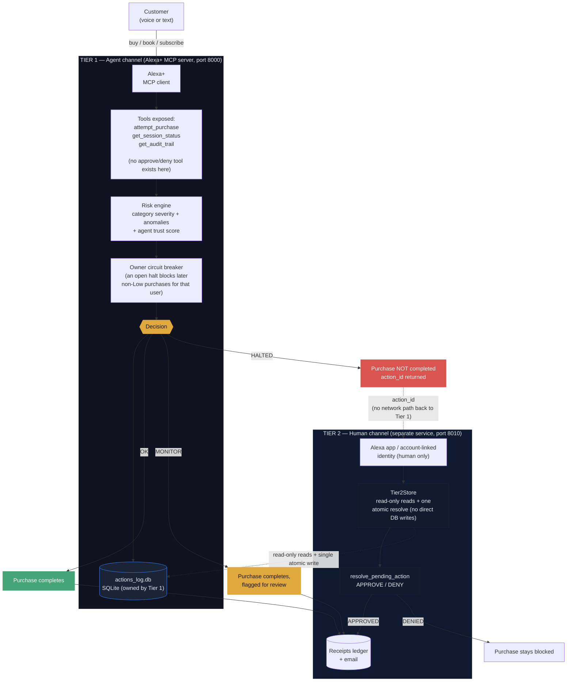

# Alguard — Alexa+ Purchase Guard

Agent-side risk halt for Alexa+ purchases, shipped as a self-hosted MCP add-on
(Streamable HTTP, MCP spec 2025-11-25+). It scores every `attempt_purchase`,
auto-completes everyday buys, and pauses high-risk ones until the human approves
on a separate channel. HALT explanations are generated with Amazon Bedrock.

> **The system that requests a risky action is never the system that approves it.**
> The agent has a tool to *attempt* a purchase — no tool to *approve* one it halted.

## Two tiers

- **Tier 1 — `mcp_server/`** (agent channel): the MCP server Alexa+ talks to. Exposes
  `attempt_purchase`, `get_session_status`, `get_audit_trail`. No approve/deny tool here.
- **Tier 2 — `web_api/`** (human channel): a separate FastAPI service, reachable only
  through an authenticated end-user channel. The only place a HALTED action can be
  approved or denied.

## Alexa+ compliance

Built against the Alexa+ MCP QuickStart Guide and Design Guide.

- **Transport** — Streamable HTTP, MCP spec 2025-11-25+ (legacy SSE is not accepted).
- **Onboarding** — `addon-package/addon.json` (QuickStart schema). The Alexa AI CLI
  (`alexa-ai deploy`) is gated behind Private Preview (`npm install -g @alexa-ai/cli`
  returns 404; see `docs/friction_log.md` #1).
- **Tools** — one tool per customer intent; "declare only what you honor". `category` is a
  closed enum (no free text to mis-spell), and there is no `agent_id` argument — identity
  comes from the authenticated request context, never from the model.
- **Error contract** — invalid `amount`/`item`/`merchant`/`category` raise proper MCP
  errors (`isError: true`) instead of silently scoring garbage input.
- **Receipts** — every completed purchase writes a receipt (`data/receipts_ledger.jsonl`
  + optional email), a certification requirement.

## Architecture



The dashed arrow from `Blocked` to the human channel is deliberate: there is no direct
network path there — only an `action_id` the customer carries to a separate service.

## Run

Both tiers fail closed without OAuth; set `ALGUARD_DEV_MODE=1` for local dev.

```bash
pip install -r requirements.txt        # runtime deps (pinned)
pip install -r requirements-dev.txt    # pytest + test-only deps
pytest -q                              # 61 tests, no MCP transport needed
```

```bash
# terminal 1 — Tier 1 (MCP server, port 8000)
ALGUARD_DEV_MODE=1 python -m mcp_server.server
# terminal 2 — Tier 2 (resolution API, port 8010)
ALGUARD_DEV_MODE=1 ALGUARD_DEV_USER=UNVERIFIED_DEV_AGENT python -m web_api.resolve_action
# terminal 3 — demo client
python demo/golden_path.py
```

Real Alexa+ onboarding: `alexa-ai configure` → tunnel port 8000 → fill the `REPLACE_ME`
URLs in `addon-package/addon.json` → `alexa-ai deploy` → test in the Web Simulator.

## Bedrock (HALT explanations)

`mcp_server/utils/bedrock_explain.py` turns the risk engine's internal vocabulary into a
calm customer-facing sentence via the Bedrock `converse` API. Non-critical path: it never
changes the OK/MONITOR/HALTED decision, only the wording. Env: `AWS_REGION`,
`ALGUARD_BEDROCK_MODEL_ID`. IAM: `bedrock:InvokeModel`.

## Not built yet

- A running OAuth authorization server (the token verifier is real; account linking and
  Alexa's redirect URIs need the Amazon developer console / Private Preview).
- Real merchant execution after approval (Checkout / `ChargePermissionId`).

## Configuration

| Variable | Purpose |
|---|---|
| `OAUTH_JWKS_URL`, `OAUTH_ISSUER_URL`, `OAUTH_AUDIENCE` | OAuth 2.1 resource-server auth (Tier 1) |
| `OAUTH_TIER2_AUDIENCE`, `OAUTH_TIER2_SCOPES` | Tier 2 auth (own audience + `approve` scope) |
| `ALGUARD_DEV_MODE=1` | Opt into unauthenticated local dev |
| `ALGUARD_DEV_USER` | Tier 2 dev identity |
| `AWS_REGION`, `ALGUARD_BEDROCK_MODEL_ID` | Bedrock HALT explanations |
| `ALGUARD_DB_PATH` | Relocate the actions ledger |
| `ALGUARD_UNKNOWN_MERCHANT_CAP` | Unknown-merchant cap (default $250) |

## Project structure

```text
mcp_server/          Tier 1 MCP server + risk engine
  server.py          attempt_purchase / get_session_status / get_audit_trail
  utils/             scoring, circuit breaker, receipts, auth, Tier2Store
web_api/             Tier 2 human-approval service
demo/                golden_path, simulate_session, agent_demo
tests/               61 pytest tests
addon-package/       addon.json (Alexa+ add-on manifest)
data/                SQLite schema + receipts ledger
```

## Security model

Alguard treats every value supplied by the calling agent as untrusted input.

- **Untrusted input** — `category`, `amount`, `merchant`, `item`, `session_id` all come
  from the agent; the server validates them, re-derives severity, and scopes all history,
  limits and the circuit breaker to the verified OAuth `sub`.
- **Hard rules** (always halt): >$1000 single purchase; >$1500/h or >$3000/24h;
  high-severity category; retrying a merchant halted and never approved in 24h; >$250 at
  an unapproved merchant.
- **Cold start** — a small purchase at an unknown merchant is MONITOR (still completes);
  unknown merchants are only halted above the cap or via another hard rule.
- **Merchant trust** — only from a human APPROVED resolution, never a static allowlist.
- **Circuit breaker** — an open (unresolved/denied) HALT blocks further non-low purchases
  for that user for 24h.
- **Authentication** — both tiers fail closed: no OAuth → Tier 1 won't start, Tier 2
  returns 503, unless `ALGUARD_DEV_MODE=1`.
- **Tier 2** — own audience + `approve` scope; approvals owner-bound, expire in 30 min,
  single atomic UPDATE; reads via read-only `Tier2Store` (`mcp_server/utils/tier2_store.py`).

## Known limitations

- **Not in the payment path** — Alexa+ can buy without calling it; a real gate needs
  Checkout / `ChargePermissionId`.
- **Category truth is heuristic** — the right source is the MCC/merchant data of the
  payment rail.
- **Nothing is charged** — fulfillment is `simulated`.
- **Shared SQLite file** — Tier 1 and Tier 2 still share one file. Tier 2 access is
  already narrowed (read-only reads + one atomic `resolve` via `Tier2Store`); a full
  3-service split is future work.
