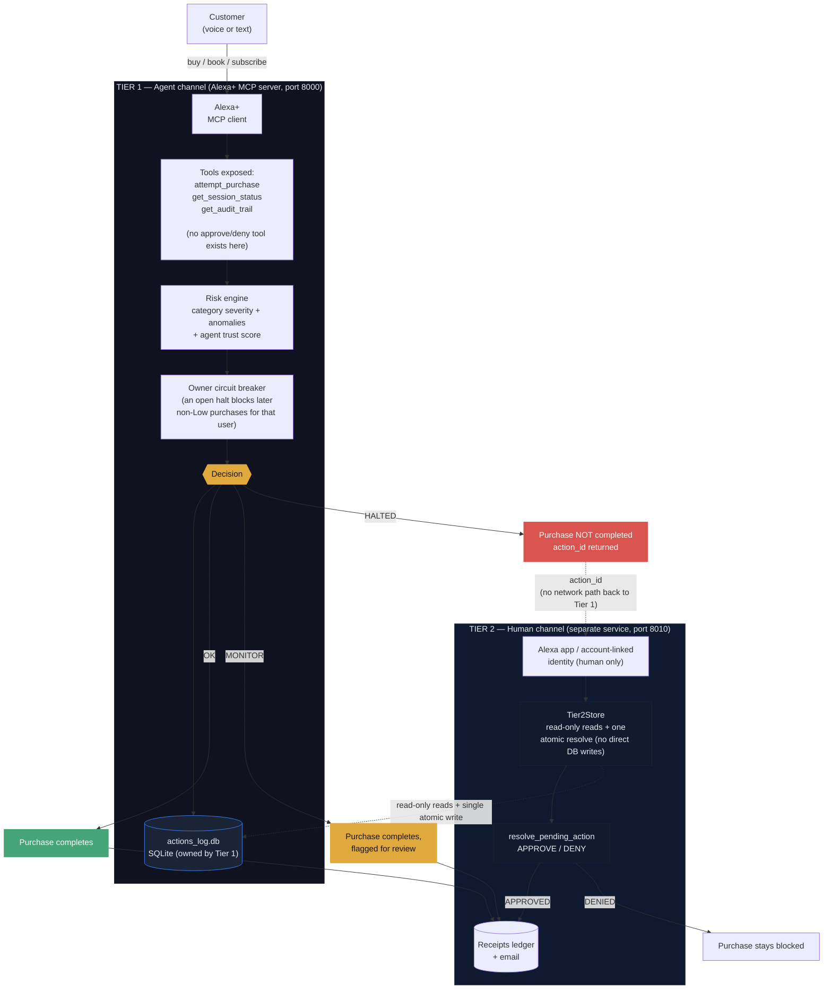

# Alguard — an Alexa+ Purchase Guard

**Primary track: Alexa+.** Self-hosted MCP add-on (Streamable HTTP, MCP spec
2025-11-25+). Customer-facing HALT explanations are generated with **Amazon
Bedrock** (`converse` API) for the AWS Builder mini-challenge.

**What it is (honest claim):** an **agent-side risk halt** for purchases exposed
through this add-on. It scores every `attempt_purchase`, auto-completes everyday
buys, and pauses high-risk ones until the human approves on a **separate**
channel. It does **not** sit on Amazon’s payment rail yet — Checkout /
`ChargePermissionId` is the next integration. Until then, fulfillment is marked
`simulated` in receipts.

The risk architecture is ported from
[Albugent](https://github.com/evaaliya/albugent_v2.0), a data-governance engine
that scores datasets for risk and halts anything above a threshold pending human
review — categories and datasets became purchase attempts and sessions, but the
core rule carried over unchanged, built strictly on Amazon's own MCP Toolkit for
Alexa+ (developer.amazon.com/docs/alexaplus/add-ons/):

> **The system that requests a risky action is never the system that approves it.**

In Albugent this was: the LLM/agent can call `apply_patch` only through a UI button,
never as a tool call. Here it becomes: **the Alexa+ agent has an MCP tool to *attempt*
a purchase, but no tool to *approve* one it halted.**

## Built on Amazon's own tooling, not a generic MCP stack

This project follows the Alexa+ MCP QuickStart Guide and MCP Design Guide for Alexa+
end to end, not just "an MCP server that happens to work":

- **Transport & spec**: Streamable HTTP, MCP spec 2025-11-25+ (Alexa+ MCP Toolkit's
  hard technical requirement -- the legacy SSE transport is not accepted).
- **Onboarding**: `addon-package/addon.json` (this repo includes one, schema per the
  QuickStart Guide). The **Alexa AI CLI** (`alexa-ai configure` / `alexa-ai deploy`)
  is the documented registration path, but it is gated behind Private Preview --
  `npm install -g @alexa-ai/cli` returns 404 on the public npm registry (see
  `FRICTION_LOG.md` #1). We built the MCP server to spec and tested it with a generic
  MCP client (`demo/simulate_session.py`, `demo/golden_path.py`, `demo/agent_demo.py`)
  plus the browser UI (`web_api/demo_server.py`).
- **Tool design**: every tool below follows the Design Guide's "Tools, Schema, and
  Data Design" rules -- one tool per customer intent, a description stating when/why
  to call it and what it returns, and "declare only what you honor" (see the
  `agent_id` note below).
- **Testing**: the guide-prescribed path is "Test in the Web Simulator" after
  `alexa-ai deploy`. Until simulator access is available, `demo/simulate_session.py`
  and `demo/agent_demo.py` are stand-in generic MCP clients; `pytest -q` exercises
  the decision pipeline with no MCP transport at all.

### A correction the Design Guide forced

The guide is explicit: *"Declare only what you honor... A parameter the model can
send but your server silently ignores produces confidently wrong answers, since the
model trusts the schema and fills arguments based on it."* An earlier version of this
project had `attempt_purchase(agent_id, ...)` -- but `agent_id` isn't something Alexa+
can honestly know; it would have to invent it, and a bad-faith caller could pass any
agent_id it wants, quietly defeating the trust-score check in `risk_evaluator.py`.
Caller identity now comes from `mcp_server/utils/auth_context.py`, which reads it off
the authenticated request context (via FastMCP's `Context`), not from an
LLM-suppliable tool argument. Real identity verification needs Account Linking (OAuth
2.1 + PKCE S256) configured in the Amazon developer console -- see "Not yet done"
below.

### Corrections the Functional Requirements forced

Certification review (developer.amazon.com/docs/alexaplus/add-ons/functional-requirements.html)
surfaces a checklist, not just guidance. A few of its rules changed actual code here:

- **#13, MCP Tool Validation** -- *"Include common synonyms, abbreviations, and
  alternate spellings in your tool parameter descriptions and enums so variants
  resolve correctly."* `category` used to be free text matched by substring
  (`"gift_card" in category.lower()`), which would silently miss `"gift card"` (a
  space instead of an underscore) and quietly downgrade a High-severity purchase to
  Low. Fixed by making `category` a closed `Literal[...]` enum in the tool schema
  (`CATEGORY_VALUES` in `category_risk.py`) -- there's no longer a spelling for the
  model to get wrong, and severity lookup is now an exact match, not a guess.
- **#13** -- *"use the MCP error contract (isError: true or JSON-RPC errors) for
  failures rather than returning malformed payloads"* and *"gracefully handle
  unexpected or invalid parameters."* `get_audit_trail` used to return
  `{"error": "not found"}` as an ordinary successful result; it now raises, so FastMCP
  produces a proper MCP error response. `attempt_purchase` now validates `amount`,
  `item`, and `merchant` before doing anything, raising instead of silently scoring
  garbage input.
- **#8, Transaction Flow** -- *"Detect and prevent duplicate transactions"* and
  *"Deliver a receipt via at least one channel... after payment."* Neither existed
  before. `session_profiler.py` now flags a `duplicate_attempt` (same item/merchant/
  amount attempted twice in one session), which forces at least MONITOR through the
  existing anomaly-flag path. `mcp_server/utils/receipts.py` is a stub call site for
  the required post-purchase receipt -- it logs instead of actually sending one; wire
  in a real channel (transactional email, SMS, Alexa notifications) before
  certification.
- **#8** -- *"Require explicit confirmation with key details before any
  high-consequence action (payment, cancellation, deletion)"* is, almost word for
  word, the reason this whole project's HALT/Tier-2 design exists. Worth knowing this
  isn't just our own risk-management preference -- it's a certification requirement
  independent of this project.

## Two trust tiers

- **Tier 1 -- `mcp_server/`**: the MCP server Alexa+ actually talks to (Streamable
  HTTP). Exposes `attempt_purchase`, `get_session_status`, `get_audit_trail`. Nothing
  else. It never returns thresholds/flags to the agent.
- **Tier 2 -- `web_api/`**: a separate FastAPI service reachable only through an
  authenticated end-user channel (the Alexa companion app, in a real deployment). The
  only place a HALTED action can be approved or denied. Not an MCP tool, not listed in
  `addon.json`'s `integrations`, not reachable from the agent.

This maps onto something Amazon already ships: the Payments for Alexa+ guide
describes an Amazon Wallet consent flow where the customer "sees a message to scan a
QR code or check notifications in the Alexa app" before a charge completes -- the same
shape as our HALTED -> Tier 2 approval step. Wiring `resolve_pending_action` to an
actual charge (via `ChargePermissionId` / a partner-wallet checkout API) is future
work, described in "Implement Checkout Endpoints" -- out of scope for this MVP.

## Architecture



The dashed arrow from `Blocked` to the human channel is deliberate: it's a dashed
line, not a solid one, because there is no direct network path there -- only an
`action_id` the customer carries over to a completely separate service.

## Running it

### Local development / logic check (no Amazon account needed)

```bash
pip install -r requirements.txt        # runtime deps (pinned)
pip install -r requirements-dev.txt    # pytest + test-only deps
# fully reproducible install (exact transitive versions):
# pip install -r requirements.lock
pytest -q                              # decision pipeline, no transport involved
```

### Real MCP transport, generic client (before you have simulator access)

```bash
# Both tiers FAIL CLOSED without OAuth. Set ALGUARD_DEV_MODE=1 for local dev.
# terminal 1
ALGUARD_DEV_MODE=1 python -m mcp_server.server        # Tier 1, Streamable HTTP, port 8000
# terminal 2
ALGUARD_DEV_MODE=1 ALGUARD_DEV_USER=UNVERIFIED_DEV_AGENT python -m web_api.resolve_action  # Tier 2, port 8010
# terminal 3
python demo/simulate_session.py
```

### The actual Alexa+ onboarding path

```bash
alexa-ai configure                 # LWA OAuth login, once
# expose mcp_server (port 8000) via a tunnel, e.g.:
cloudflared tunnel --url http://localhost:8000

# fill addon-package/addon.json: privacyPolicyUrl, termsOfUseUrl, mediaAssets,
# and integrations[0].config.endpoints.default.uri = your tunnel/deployed URL

alexa-ai deploy                    # registers the add-on, dev stage
# then: Test in the Web Simulator (developer.amazon.com/alexa/console/ask/addons)
```
## AWS Builder mini-challenge — Amazon Bedrock

`mcp_server/utils/bedrock_explain.py` calls Amazon Bedrock via the
`converse` API to turn the risk engine's internal vocabulary
(`risk_score >= threshold, severity=High, flags=[retry_after_halt]`) into a
calm sentence a customer will actually read. Every HALTED response in the
Golden Path (`demo/golden_path.py` Step 2) surfaces that Bedrock-generated
message back through the MCP tool result.

**Non-critical path by design:** the decision is already made when Bedrock
is called. Bedrock never changes OK / MONITOR / HALTED — only the wording.

**Env vars:**
- `AWS_REGION` (e.g. `us-east-1`)
- `ALGUARD_BEDROCK_MODEL_ID` (e.g. `amazon.nova-lite-v1:0`)

**IAM:** needs `bedrock:InvokeModel` / `bedrock:InvokeModelWithResponseStream`
on the model ARN.

**Status:** working in the product path. HALTED customer copy is produced by
Bedrock on every halt. Account-access friction for fresh AWS accounts is
documented for organizers in `FEEDBACK.md` and `docs/friction_log.md` #2 —
it does not block the demo or the Golden Path.

## What's intentionally NOT built yet

- **A real OAuth authorization server**: `mcp_server/utils/auth_context.py` is now a
  real, working OAuth 2.1 resource-server token verifier (JWT + JWKS, via the MCP
  SDK's `TokenVerifier`/`AuthSettings`) -- point `OAUTH_JWKS_URL`, `OAUTH_ISSUER_URL`,
  `OAUTH_AUDIENCE` at any real authorization server (Auth0, Cognito, Okta...) and it
  validates real tokens. What's still missing is *running* that authorization
  server and registering Alexa's redirect URIs with it -- see "Enable real OAuth"
  below. Without those env vars set, the server FAILS CLOSED -- it refuses to start
  unless you explicitly set ALGUARD_DEV_MODE=1 for local dev. Also note: the MCP SDK
  adds a `WWW-Authenticate`
  header to 401 responses, which the Alexa+ Authentication checklist currently lists
  as "Not Supported Yet" on their side -- flagged in a code comment, not fixed, since
  it can't be tested against real Alexa+ without Private Preview access.
- Real merchant execution after a Tier 2 approval, and the actual Alexa+ Checkout API
  integration (`ChargePermissionId` / partner wallet, per "Implement Checkout
  Endpoints") -- stubbed with a comment in `apply_resolution.py`.

## Enable real OAuth (optional, for testing auth locally)

Point these env vars at any OAuth 2.1 authorization server before starting
`mcp_server.server` (a free Auth0 or Cognito test tenant works fine for this):

```bash
export OAUTH_JWKS_URL="https://your-auth-server.example.com/.well-known/jwks.json"
export OAUTH_ISSUER_URL="https://your-auth-server.example.com/"
export OAUTH_AUDIENCE="http://localhost:8000/mcp"
export OAUTH_REQUIRED_SCOPES="purchase"   # optional, space-separated
python -m mcp_server.server
```

`demo/simulate_session.py` doesn't send a Bearer token, so with auth enabled it will
get rejected -- that's the point (proves the auth actually rejects unauthenticated
callers). Without auth, start the server with ALGUARD_DEV_MODE=1 (local dev only).

## View a delivered receipt

Every completed purchase (`OK`/`MONITOR`, or a `HALTED` one a human later approves)
writes a real receipt to `data/receipts_ledger.jsonl` and, if `SMTP_HOST` is
configured, also emails it. Read one back via the Tier 2 service:

```bash
# Tier 2 requires a Bearer token (or ALGUARD_DEV_USER for local demos)
curl -H "Authorization: Bearer $TOKEN" http://127.0.0.1:8010/receipts/<action_id>
```

## Security model (read this before the judges do)

**What the engine does NOT trust:** every tool argument. `category`, `amount`, `merchant`,
`item`, `session_id` all come from the agent. The server (a) validates them (finite, bounded,
closed enum), (b) re-derives severity from item/merchant text and an unknown-merchant floor,
(c) keys all history, limits and the circuit breaker to the verified OAuth `sub` of the
end user -- not to `session_id`, not to the Alexa `client_id`.

**Hard rules** (cannot be out-scored): >$1000 single purchase, >$1500/h or >$3000/24h spend,
High-severity category, retrying a merchant that was halted and never approved within the
last 24h, and any purchase above `ALGUARD_UNKNOWN_MERCHANT_CAP` (default $250) at a merchant
this user has not explicitly approved before.
**Cold start:** a small purchase at an unknown merchant is **MONITOR** (flagged, still
completes) — not an instant HALT. HALT for unknowns only kicks in over the cap, or via
High category / other hard rules. That keeps everyday shopping usable while still
catching gift cards, wires, and large first-time charges.
**Merchant trust** comes only from a human APPROVED resolution — not from a static allowlist.
A merchant that was never approved is treated as unknown, even if the agent uses a familiar
name (`amazon`, `amazon_basics`, ...).
**Circuit breaker:** while a user has an unresolved or denied HALT (24h), any non-Low purchase
is HALTED; approval by the human closes it.
**Auth:** both tiers FAIL CLOSED. Without `OAUTH_*`, Tier 1 refuses to start and Tier 2
returns 503 unless you explicitly set `ALGUARD_DEV_MODE=1` (local dev only) — there is no
silent unauthenticated mode. With OAuth configured, identity is the verified JWT `sub`.
Tier 2 uses a **separate** audience + `approve` scope so an agent-channel token can never
approve. Demos print `AUTH: OFF/ON` at startup so the video makes the mode obvious.
**Tier 2:** fails closed; Bearer JWT with its own audience + `approve` scope; approvals are owner-
bound, expire (30 min), and are a single atomic conditional UPDATE. Tier 2 reads through a
read-only `Tier2Store` (`mcp_server/utils/tier2_store.py`) and its only write is that atomic
resolution — it has no access to Tier 1's insert/reset/trust write helpers.

**What is still NOT solved (be honest about it):**
- This server is not in the payment path. Alexa+ can buy without calling it. It becomes a real
  gate only when it issues the charge permission itself (Checkout / wallet integration).
- Category truth should come from MCC/merchant data of the payment rail, not text heuristics.
- Nothing is charged; receipts are marked `simulated`.
- Tier 1 and Tier 2 still share a SQLite file. **Already done (safe MVP level):** Tier 2 has
  no arbitrary DB access — `mcp_server/utils/tier2_store.py` gives it only read-only reads
  plus exactly one atomic `resolve`, so the "write-only API" is effectively implemented
  in-process. **What remains is a full 3-service refactor before production:** (1) move the
  DB owner into its own process, (2) rewrite Tier 1 (MCP server) to call that process over
  HTTP instead of writing via `process_attempt` directly, (3) rewrite the demos and all
  tests. That touches Tier 1's hot path, the demo scripts and all 61 tests, so it is
  deliberately left out of the MVP to avoid destabilising the working end-to-end path.

